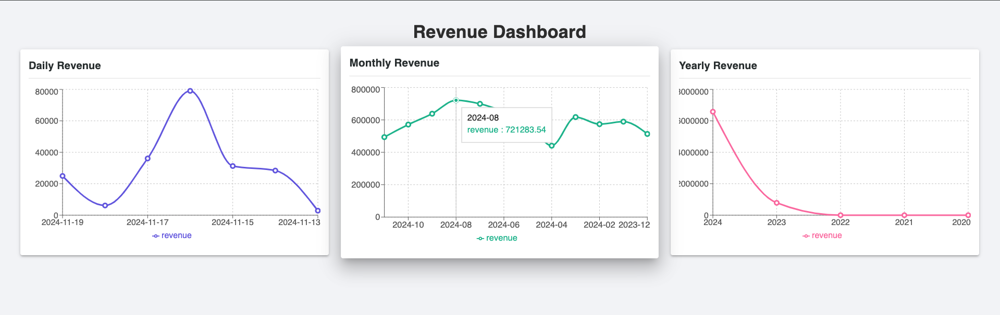
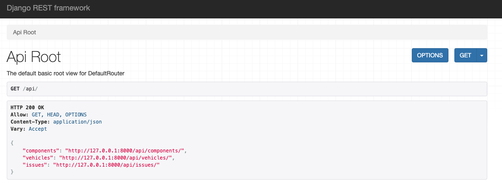
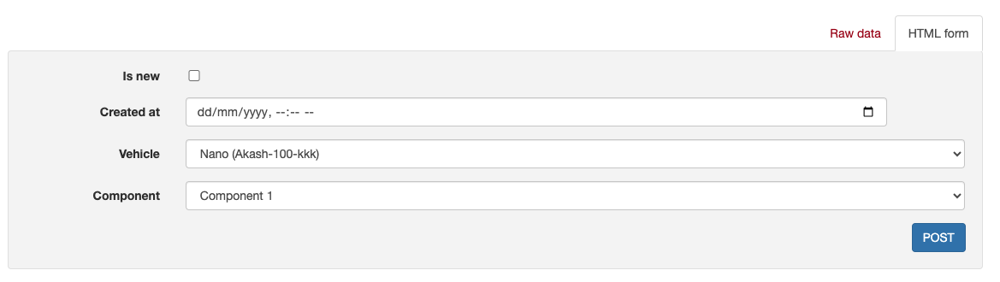

# Delivery Management System

A full-stack web application designed for managing vehicle service operations, including tracking vehicle repairs, component purchases, pricing, and displaying revenue graphs for analysis.

This project implements a **Vehicle Service System** that allows users to:
- Register components with repair and purchase prices.
- Add vehicles and their issues.
- Choose between new components or repairs for vehicles.
- Calculate total prices for services and allow payments.
- Display interactive graphs for daily, monthly, and yearly revenues, including other useful charts to analyze data like component sales, issue counts, and component repair/purchase breakdowns.

## Tech Stack

- **Backend**: Django (with Django Rest Framework)
- **Frontend**: React.js
- **Database**: SQLite (default), but can be configured to use PostgreSQL or MySQL
- **Graphing Library**: Recharts (for interactive, responsive charts)

## Features

1. **Graphical Data Representation**:
   - **Daily Revenue**
   - **Monthly Revenue**
   - **Yearly Revenue**

2. **CRUD Operations**:
   - Register components and vehicles
   - Add issues to vehicles (choose between new components or repairs)
   - Calculate final prices

3. **Backend**:
   - REST API to handle vehicle, issue, and component operations
   - API endpoints to fetch revenue and other data to render in graphs

4. **Frontend**:
   - Modern UI with Material-UI components
   - Dynamic, responsive graphs using Recharts

---

## Setup Instructions

### Backend (Django)
1. **Clone the repository:**
   ```
   git clone https://github.com/akssingh0102/delivery-management-system.git
   cd delivery-management-system
   ```

2. **Create a virtual environment:**
   ```
   python3 -m venv env
   source env/bin/activate # For MacOS/Linux
   env\Scripts\activate # For Windows
   ```

3. **Install dependencies:**
   ```
   pip install -r backend/requirements.txt
   ```

4. **Run migrations:**
   ```
   python manage.py migrate
   ```

5. **Create a superuser (admin):**
   ```
   python manage.py createsuperuser
   ```

6. **Run the development server:**
   ```
   python manage.py runserver
   ```
   The backend will be running on `http://127.0.0.1:8000`.

### Frontend (React)
1. **Navigate to the frontend directory:**
   ```
   cd frontend
   ```

2. **Install dependencies:**
   ```
   npm install
   ```

3. **Configure the API URL:**
   - Open the `frontend/src/GraphPage.js` file.
   - Modify the API URL in the `axios.get` function to point to your local or deployed backend:
     ```
     axios.get('http://127.0.0.1:8000/api/revenue/')
     ```

4. **Start the frontend server:**
   ```
   npm start
   ```
   The frontend will be running on `http://localhost:3000`.

---

## Usage

1. **Access the Backend:**
   - Open `http://127.0.0.1:8000/admin` to access the Django Admin Panel.
   - Log in using the superuser credentials you created.
   - You can manage components, vehicles, and issues from the admin interface.

2. **Access the Frontend:**
   - Open `http://localhost:3000` to view the graphical dashboard.
   - The dashboard displays different graphs such as Daily, Monthly, and Yearly revenue, Component-based revenue, and Issue data.

3. **Interacting with the UI:**
   - You can interact with the displayed graphs, which are responsive and dynamically update based on data.
   - The data for these graphs is fetched from the backend via REST API calls.

4. **Populating Data:**
   - Use the Django admin panel to add components, vehicles, and issues or use Django RestFramework UI `http://127.0.0.1:8000/api/`
   - Alternatively, you can run Python scripts (as outlined in the script generation section) to populate the models with sample data.

---

## Endpoints

- **GET** `/api/revenue/`:
  - Fetches revenue data for daily, monthly, and yearly breakdowns.
  - Returns data used for rendering the revenue graphs.

- **POST** `/api/vehicles/`:
  - Creates a new vehicle.

- **POST** `/api/components/`:
  - Creates a new component (new or repair).

- **POST** `/api/issues/`:
  - Creates a new issue for a vehicle (specifies whether it's a new or repair component).

---

## Sample Data Population Script

You can use a Python script to populate the system with sample data.

1. **`seed_data.py` file** in the backend folder `seed`.
2. **Populate models with sample data** by running the script:

```
from services.models import Component, Vehicle, Issue
from django.utils.timezone import now, timedelta
import random

# Generate a large dataset
NUM_COMPONENTS = 50
NUM_VEHICLES = 200
NUM_ISSUES = 1000

# Helper function to generate random dates
def random_date(start, end):
    delta = end - start
    random_days = random.randint(0, delta.days)
    return start + timedelta(days=random_days)

# Create Components
component_objs = []
for i in range(NUM_COMPONENTS):
    obj, created = Component.objects.get_or_create(
        name=f"Component {i + 1}",
        repair_price=random.uniform(500, 5000),
        purchase_price=random.uniform(1000, 15000),
    )
    component_objs.append(obj)

print(f"{len(component_objs)} components added.")

# Create Vehicles
vehicle_objs = []
for i in range(NUM_VEHICLES):
    obj, created = Vehicle.objects.get_or_create(
        name=f"Vehicle {i + 1}",
        registration_number=f"REG{i + 1:04d}",
    )
    vehicle_objs.append(obj)

print(f"{len(vehicle_objs)} vehicles added.")

# Create Issues
issues = []
start_date = now() - timedelta(days=365)  # 1 year ago
end_date = now()

for _ in range(NUM_ISSUES):
    vehicle = random.choice(vehicle_objs)
    component = random.choice(component_objs)
    is_new = random.choice([True, False])
    created_at = random_date(start_date, end_date)
    issue = Issue.objects.create(
        vehicle=vehicle,
        component=component,
        is_new=is_new,
        created_at=created_at,
    )
    issues.append(issue)

print(f"{len(issues)} issues added.")
```

Run the script by executing the following command in your backend directory:

```
python manage.py shell < seed/seed_data.py
```

---

## License

This project is licensed under the MIT License - see the [LICENSE](LICENSE) file for details.

---

## Acknowledgements

- **Django**: Web framework used for the backend.
- **React**: Frontend framework used for the dashboard.
- **Recharts**: Used for graphing and data visualization.
- **Material-UI**: Design system used to build the UI components.


## Screen-shorts

**Graph Page**



**Django REST framework**


**Manual Data Creation**
